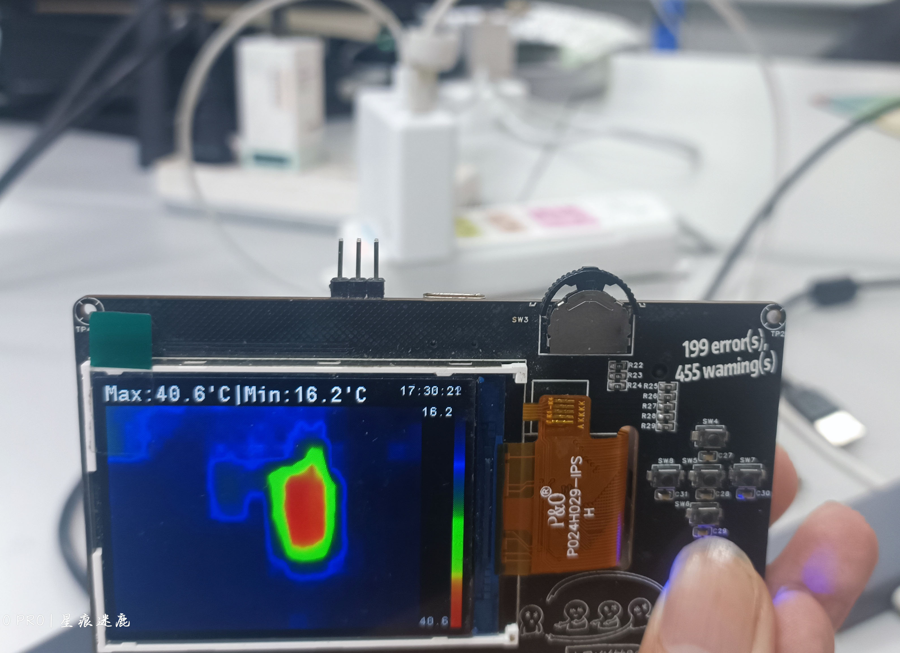
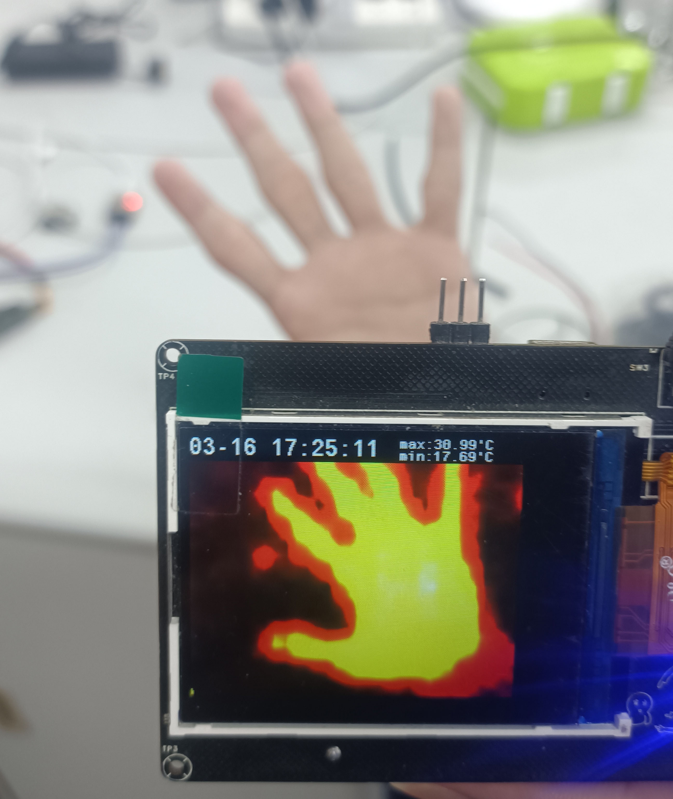
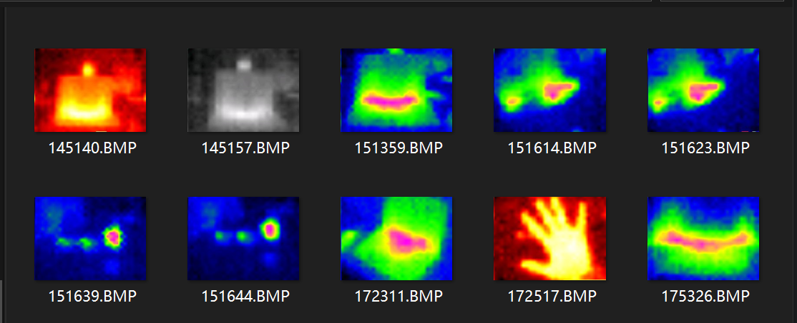

<div align="center">



# 热成像相机📷


</div>

## 🔍项目简介

该项目是一个基于STM32、MLX90640的热成像相机项目，采用STM32F407VET6主控芯片，MLX90640热成像传感器、W25Q64存储芯片。

---

## 🎮功能特性

  * 实时采集热成像数据、使用插值算法扩大图像并显示到屏幕
  * 多种色彩映射函数
  * 可将当前图像存储至FLASH
  * PC可以直接以U盘形式读取FLASH
  * 时钟芯片可以显示时间【可以添加文件写入时间，还没实现】
  * IP5306实现电源管理

## 🚧目前已知存在的问题和未添加的功能

  * 连接PC时，读取和写入图像可能会产生冲突导致错误
  * 保存的bmp文件最左侧会有一列错误数据
  * 部分像素偶现错误数据，暂未处理
  * 保存的文件添加保存时间
  * 没有调整时钟芯片内部时间的程序逻辑，只能通过手动编译下载新程序修改

## 🔌硬件设计

  * STM32F407VET6 单片机
  * MLX90640 热成像传感器
  * W25Q64 存储芯片
  * IP5306 电源管理
  * DS3231 时钟芯片
  * ST7789 屏幕驱动

## 💻软件环境

  * STM32CubeMX、Keil5、VScode+EIDE

## 📕使用说明

### 基本操作

  1. 单击按键即可启动，初始化完成后自动开始读取数据和显示。
  2. 双击按键即可关闭。
  3. 中心按键按下即可保存图像。
  4. c口连接电源即可充电，连接至PC可以识别到U盘，能够管理保存的图像。
  5. 拨盘左右拨动可以切换色彩映射方案。

　
　
　
　

## 项目目录结构

```
thermal_camera/
├── README.md                  # 项目说明文档
├── Thermal...camera.ioc       # CubeMX生成的IOC文件
├── APP                        # 主任务【包含图像读取插值显示保存】
├── BSP                        # 各类芯片驱动
|    ├── DS3231                # DS3231时钟芯片驱动
|    ├── MLX90640              # MLX90640热成像传感器驱动
|    ├── ST7789                # ST7789屏幕驱动
|    └── W25Q64                # W25Q64存储芯片驱动
└── ...                        # STM32固定结构
```

## 致谢

感谢以下项目的开源代码和技术支持，为本项目的开发提供了诸多思路与参考：

  * [红外热成像仪](https://oshwhub.com/qlexcel/xuan-zhuai)
  * [MLX90640热成像仪](https://oshwhub.com/sjj12345/mlx90640-re-cheng-xiang-yi)
  * [ST7789-STM32](https://github.com/Floyd-Fish/ST7789-STM32)
  * [stm32-w25qxx](https://github.com/lbthomsen/stm32-w25qxx)

## 联系方式

如果你对该项目有任何疑问或建议，欢迎通过以下方式与我们联系：

  * **GitHub 项目主页** ：[[Thermal_imaging_camera](https://github.com/ZhangHan-star/Thermal_imaging_camera)]
